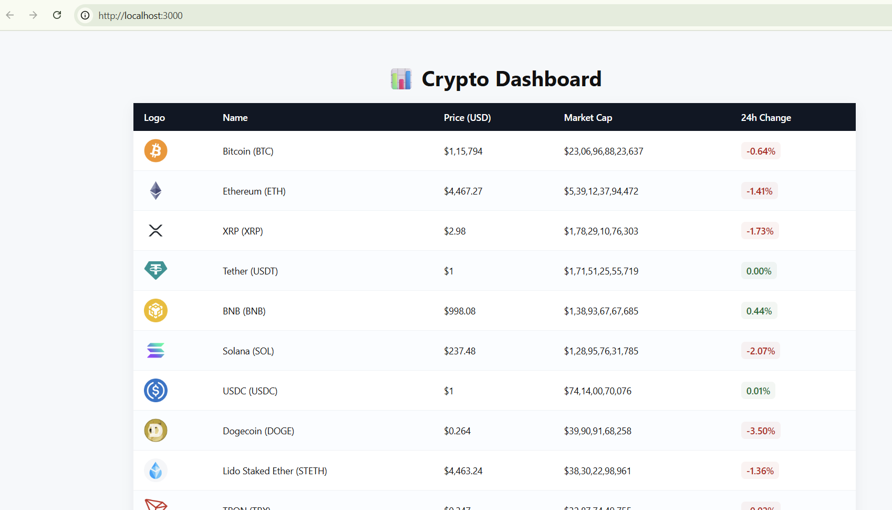

# 📊 Crypto Dashboard

A **Node.js + Express + EJS** web application that displays real-time cryptocurrency data using the **CoinGecko API**. This is my first iteration of the project, where I learned how to fetch data from a public API, render it with EJS templates, and integrate it with an Express server. Future versions will include more features and analytics.

---

## 🌟 Features

- Fetches top cryptocurrencies from **CoinGecko API**
- Displays:
  - Logo, Name & Symbol
  - Current Price (USD)
  - Market Cap
  - 24h Price Change (with color indication)
- Responsive and simple design
- First iteration focused on understanding:
  - Node.js & Express server setup
  - EJS templating
  - Integration of backend API data with frontend

---

## 📂 Folder Structure

```text
crypto-dashboard/
├─ public/
│ ├─ images/ # Screenshots and other images
│ └─ styles.css
├─ views/
│ └─ index.ejs # Main template
├─ index.js # Express server
├─ package.json
└─ README.md
```

## 📸 Screenshots

### Dashboard Home


## 🚀 Installation & Running Locally

1. Clone the repository:
```bash
git clone https://github.com/sarthaksanas/crypto-dashboard.git

cd crypto-dashboard

npm install

npm start

http://localhost:3000

⚙️ Technologies Used

Backend: Node.js, Express.js

Frontend: HTML, CSS, EJS

API: CoinGecko API

Others: Axios for HTTP requests

📈 Future Improvements

Add more coins and filters

Include historical price charts

Add search functionality

Improve UI/UX and responsiveness

Include analytics for portfolio tracking


